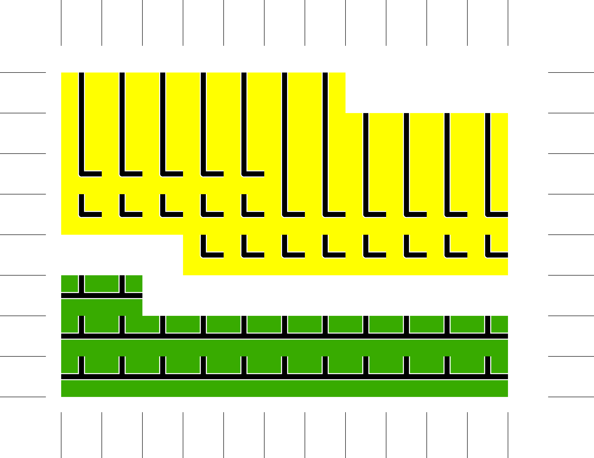

These are some supplemental PnP materials for the simplified 18xx game by galatolol:

https://www.boardgamegeek.com/thread/2044226/wip-short-and-simplified-18xx-style-game-animals

For example, here is a tiles sheet for 8.5x11 US letter paper for 3/4 inch tiles:

The images are generated by python which runs in the [drawbot](https://www.drawbot.com/) environment.

