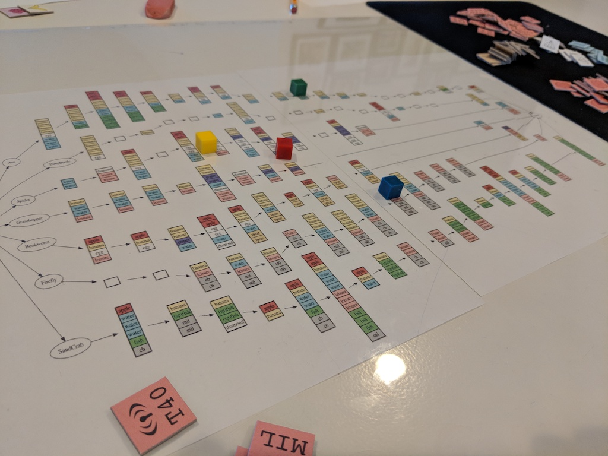

This is a map drawn using the layout tools from graphviz. See Makefile for the invocations.

To actually make it:

* produce an SVG `dot -Tsvg map.dot -o map_dot.svg`
* open in Inkscape, setting whatever page(s) size you want
* scale the svg to the page size
* print directly, or export to PNG, slice, then print from another program