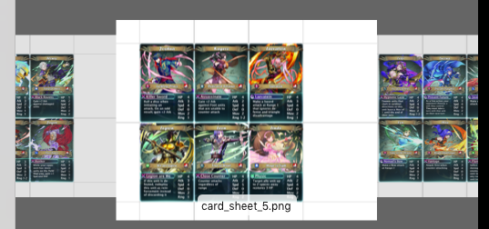

This is an attempt to recreate the lost files of MingYang Lu's DIY PnP Fire Emblem Heroes game
before it got legal-bullied off the internet by Nintendo.

https://boardgamegeek.com/boardgame/238327/fire-emblem-print-play-board-game

I'm in the US with access to only a US Letter printer, so that's what the script aims for. You can adjust it to whatever printer and paper you have.

The produced card sheets have the same ratio as 8.5 x 11 but are much larger. Your printer software will scale this down in an attempt to put it on a page, but if possible have it scale all the way past the bleed, not the trim, see https://en.wikipedia.org/wiki/Bleed_(printing).

Between a MacOS and Windows machine, I have been unable to find the default printer dialogs that can do this, so I have two other options:

* print out test card sheets (use card_blank_sheet.png) at different scalings until your target size per card is met
* get your printer's bleed size by measurement, technical specifications, or on my Mac I can hover over the paper sizes in the drop-down to reveal it - print ruler.png and make sure the squares are 1 inch

