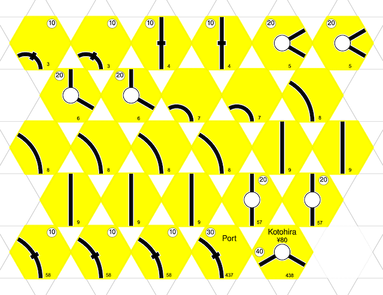
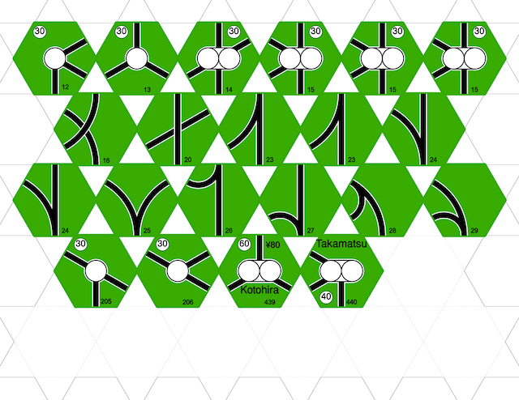

18xx tiling tool

Composite SVG's from the rails app into printable and cuttable sheets.

Examples:

Example use:

* `./gen.py 1846.manifest layout0`
* `./gen.py 1889.manifest layout0`

Notes:

Hexes are drawn with origin (0,0) in top left corner. Edge length is 196. Flat to flat is 340. Point to point is 392.
