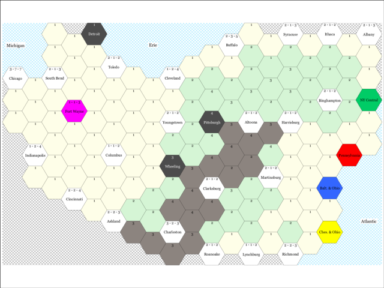

Generate Wabash Cannonball / Chicago Express maps and extras using python, pycairo, and PIL.

## Dimensions

Size is 1584x1224 which should match 22"x17" at 72DPI which is 4 US letter papers arranged in a landscape grid.

    +---------+---------+
    |         |         |
    |         |         |
    +---------+---------+
    |         |         |
    |         |         |
    +---------+---------+

## Map1, the original, gen\_map1.py

* TODO: show preview

## Map2, the redraw, gen\_map2.py

* cost at hex header
* build bonus, dev bonus at hex header

